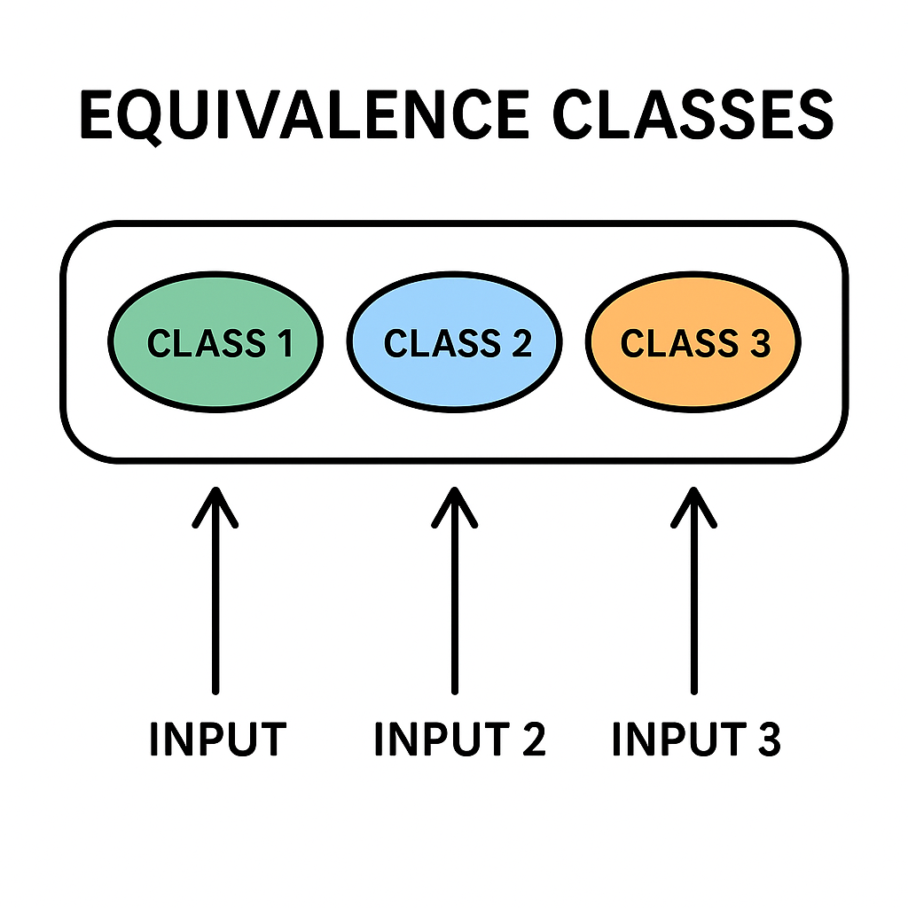

# 🚗 Vehicle Reservation App - QA Testing Project

## 📋 Project Description
In this project, I designed and executed **functional** for a **vehicle reservation web application**.  
To optimize test coverage, I applied the **Equivalence Partitioning technique**, identifying valid and invalid input ranges and creating test scenarios that validated the application’s logic.

---

## 🎯 Objectives
- Ensure the correct functionality of the **Calculation of travel time and cost**.  
- Validate both **valid and invalid inputs** to check system robustness.  

 

---

## 🛠️ Tools & Technologies
- ✅ **Test Design:** Equivalence Partitioning, Test Cases, Checklists   
- ✅ **Documentation:** Excel / Google Sheets  
- ✅ **Environment:** Web application (QA testing environment)  

---

## 🔍 Testing Approach
- Designed **equivalence classes** to optimize input validation tests.  
- Created **functional test cases** for Calculation of travel time and cost.   
- Executed both **positive and negative test scenarios**.  

---

## 📊 Some sample Test Cases
| ID | Test Scenario | Input | Expected Result | Status |
|----|---------------|-------|-----------------|--------|
| P-1 | The driving time and cost of a ride in a shared car on Urban Routes | Start: 00:01 – End: 08:00 | T = 1,4 km / 45 km/h = 1.9 min Price = 1.9 min * $0.1/min = $0.19 |  ⚠️ Bug reported |
| P-2 | The driving time and cost of a carpool ride on Urban Routes | Start: 08:01 – End: 12:00| T = 1,4 km / 30 km/h = 2.8 min Price = 2.8 min * $0.1/min = $0.28| ⚠️ Bug reported |

---

## 🐞 Findings
- Incorrect validation for some invalid hours ranges.    
- Missing error message for empty vehicle selection field.  

---

## 📌 Conclusion
This project allowed me to strengthen my **QA testing skills**, applying structured test design techniques like **Equivalence Partitioning**, ensuring **high coverage with fewer test cases**, and improving the reliability of the vehicle reservation app.  

---

